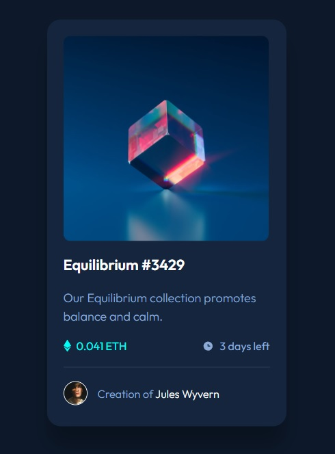

# Frontend Mentor - NFT preview card component solution

This is a solution to the [NFT preview card component challenge on Frontend Mentor](https://www.frontendmentor.io/challenges/nft-preview-card-component-SbdUL_w0U). Frontend Mentor challenges help you improve your coding skills by building realistic projects.

## Table of contents

- [Overview](#overview)
  - [The challenge](#the-challenge)
  - [Screenshot](#screenshot)
  - [Links](#links)
- [My process](#my-process)
  - [Built with](#built-with)
  - [What I learned](#what-i-learned)
  - [Continued development](#continued-development)
  - [Useful resources](#useful-resources)
- [Author](#author)
- [Acknowledgments](#acknowledgments)

**Note: Delete this note and update the table of contents based on what sections you keep.**

## Overview

### The challenge

Users should be able to:

- View the optimal layout depending on their device's screen size
- See hover states for interactive elements

### Screenshot



### Links

- Solution URL: [https://github.com/wavegate/nft-preview-card-component-main](https://github.com/wavegate/nft-preview-card-component-main)
- Live Site URL: [https://fastidious-tartufo-341c03.netlify.app/](https://fastidious-tartufo-341c03.netlify.app/)

## My process

### Built with

- Semantic HTML5 markup
- CSS custom properties
- Flexbox

### What I learned

I learned about displaying overlays by placing them in a separate element next to the image they are supposed to overlay and then positioning them absolutely on top. I felt I did a pretty good job with getting the typography correct this time.

```css
#overlay {
  position: absolute;
  top: 0px;
  left: 0px;
  height: 100%;
  width: 100%;
  display: flex;
  justify-content: center;
  align-items: center;
}
```

### Continued development

Getting the overlay working was a little tricky so I think I need more practice.

## Author

- Website - [wavegate](https://github.com/wavegate)
- Frontend Mentor - [@wavegate](https://www.frontendmentor.io/profile/wavegate)
